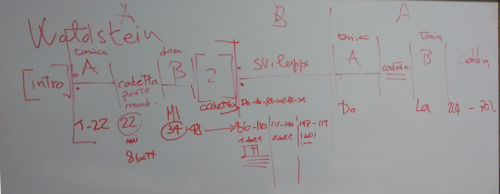

# Lezione del 18 dicembre 2015

* Analisi delle forme:
  * Esempio: *Waldstein Sonata* di Ludwig Van Beethoven, 1. mvt
    

## Compiti per la prossima volta:

* analisi del primo movimento della terza sonata di Frydrick Chopin
