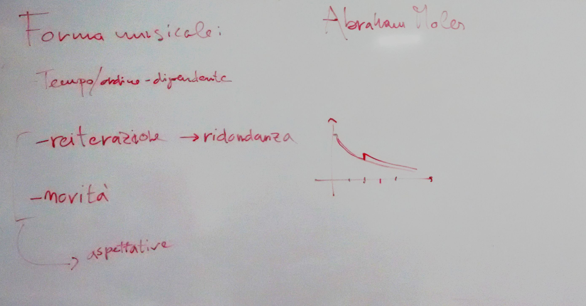

# Lezione del 8 gennaio 2016

* Analisi delle forme:
  * Verifica dell'analisi del primo movimento della terza sonata di Frydrick Chopin
* Elementi di struttura della forma musicale:
  * tempo-dipendenza
  * entropia dell'informazione (cf. Abraham Moles)
    * ridondanza
    * novità
    * aspettative (cf. *Sweet Anticipation* - David Huron)

## Compiti per casa

* Analisi della forma del I movimento di `Sud` di Jean-Claude Risset
* elaborazione di un breve passaggio algoritmico in cui si equilibrino
  ridondanza e novità per:
  * elementi ritmici (attacchi - durate)
  * elementi melodici (altezze)
  * elementi timbrici
