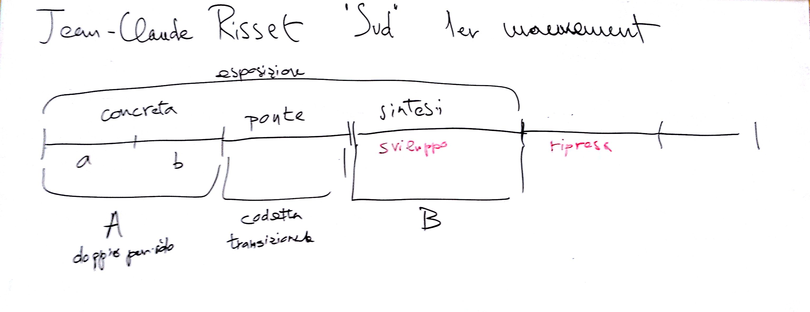

# Lezione del 22 gennaio 2016

* verifica dell'analisi della forma del I movimento di `Sud` di Jean-Claude Risset
* verifica dell'elaborazione di un breve passaggio algoritmico in cui si equilibrino
  ridondanza e novità per:
  * elementi ritmici (attacchi - durate)
  * elementi melodici (altezze)
  * elementi timbrici
* rifattorizzazione del codice ed elaborazione di `constraints` (`soft` e `hard`)
