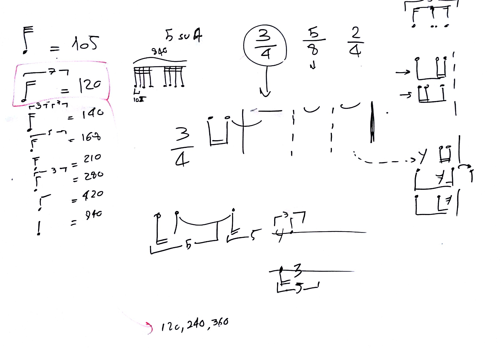

# Lezione del 05 febbraio 2016

## Argomenti

* verifica del sistema di generazione di `prime forms` scritto in `SuperCollider`
* serializzazione dei parametri ritmici

## Compito per casa

* sistema di generazione con `constraints` ritmiche `hard` e `soft`
