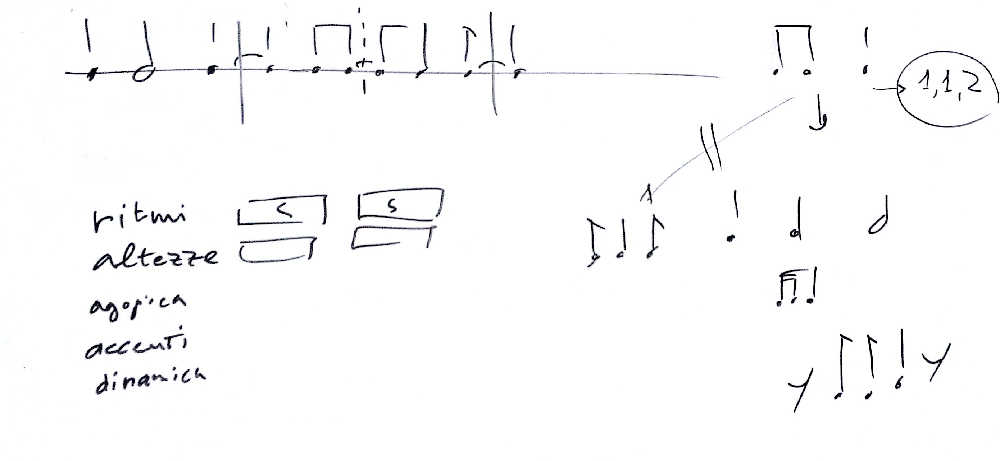

# Lezione del 4 marzo 2016

## Argomenti

* verifica del codice di generazione rifattorizzato
  * Xrhythm
  * XrhythmFigure
  * XrhythmFrac (che diventerà la superclasse Xrhythm)
  * XdivClass

## Per casa

* Xvoice
* Xmeter
* Xbar
