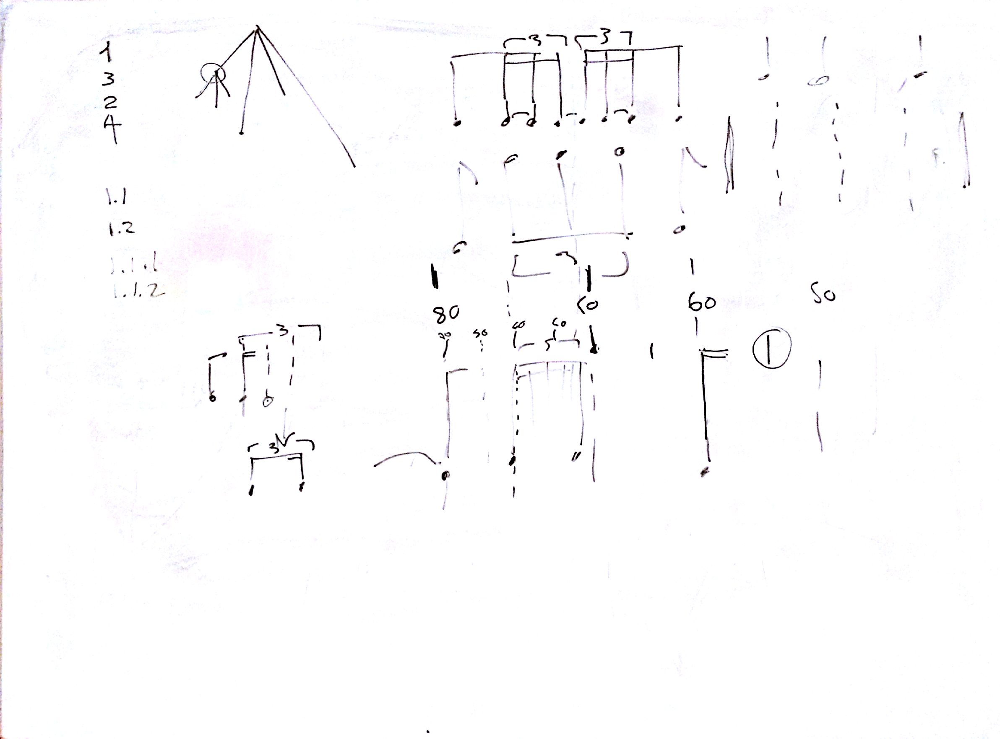

# Lezione del 1 Aprile 2016

## Argomenti

* `SuperCollider`: `Xpiece`
  * verifica classe delle frazioni
  * `Xpulse` all'interno della classe `Xvoice`

## Compiti per casa:

* creazione della classe `Phrase`
* tentativo di *riempimento grammaticale* (scelte attraverso sintesi
  grammaticale prima e poi *constrained random*)
