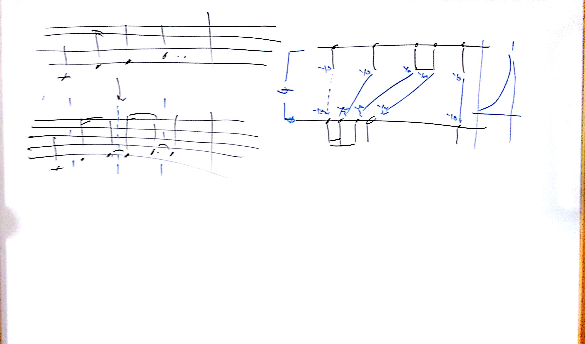

# Lezione del 15 Aprile 2016

## Argomenti

* verifica compiti per casa:
  * creazione della classe `Phrase`
  * tentativo di *riempimento grammaticale* (scelte attraverso sintesi
    grammaticale prima e poi *constrained random*)
* discussione sulle imaginary bar lines
