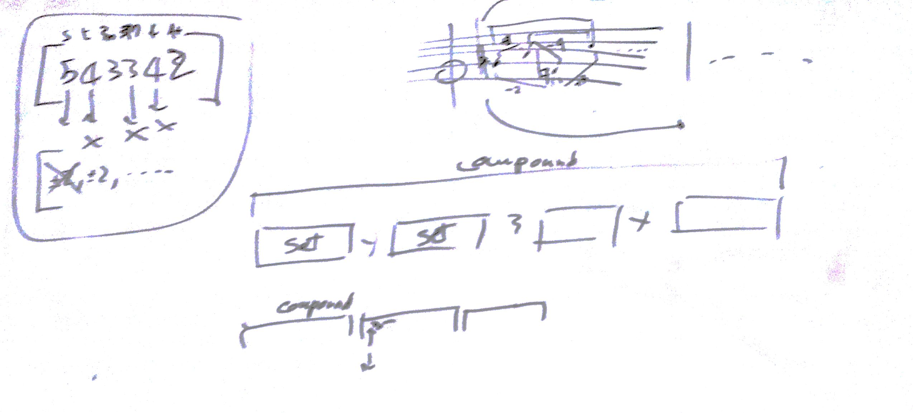

# Lezione del 13 maggio 2016

## Argomenti

* verifica funzionamento software [`XPiece`](https://github.com/DavideMaggio/Xpiece)
* riflessione sulle estensioni formali del software
  * adozione di schemi fortiani (coerenza intervallare)
  * replica telescopica di elementi (à la `Formes`)
